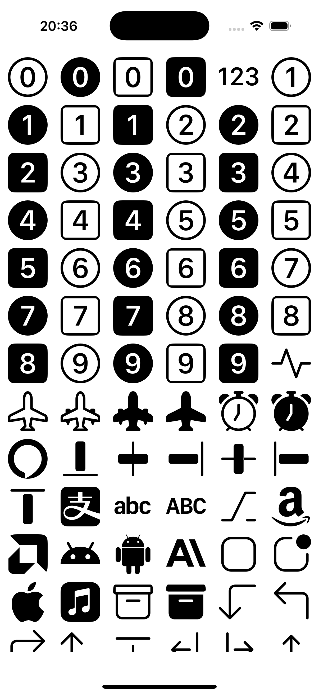

# SVGBucket

iOS SVG图标资源库，兼容iOS 11+。集成12508个SVG图标，打包到ImageIcon.bundle中（6MB）。

## 图标来源

- https://github.com/dmhendricks/file-icon-vectors
- https://icons.getbootstrap.com/
- https://remixicon.com/
- https://tabler.io/icons

总共 12508 个图标。

## 依赖

SVG 绘制使用到了 https://github.com/sammycage/lunasvg 这个库。

## 使用方法

```swift
import SVGBucket

Resource.initResource()
```

特性
支持iOS 11及以上版本

集成12508个SVG图标

图标资源打包为ImageIcon.bundle（6MB）

基于LunaSVG的高性能渲染

## 详情

详情见Demo。

## 结果

